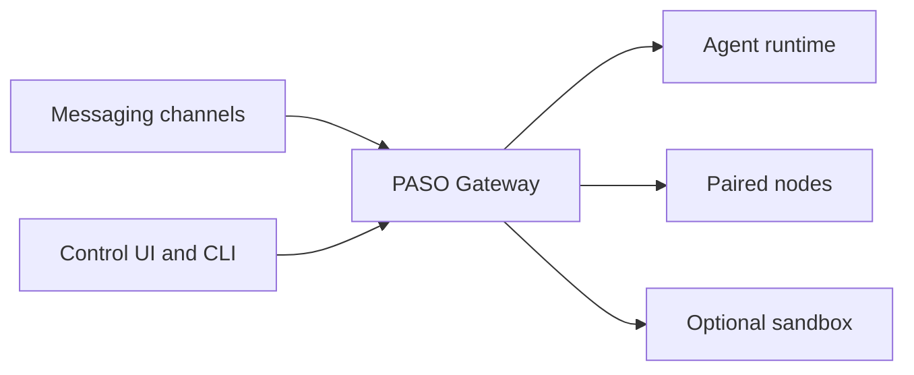

# Why PASO

PASO is an AI agent by **Celaya Solutions Research** in El Paso, Texas. It gives one operator a practical way to reach an AI assistant from messaging channels, a browser, a terminal, and supported devices while keeping the gateway under that operator's control.

PASO is built on the OpenClaw framework. The fork keeps lowercase compatibility identifiers such as the `openclaw` command, `~/.openclaw` paths, `OPENCLAW_*` environment variables, package names, and protocol fields. Those identifiers are stable technical interfaces; the user-facing product is PASO.

## Why a gateway

The Gateway is the control point for channel connections, sessions, routing, credentials, and policy. One running Gateway can serve several channel plugins and user interfaces without copying the agent's state into every app.

This layout makes deployment choices explicit:

- Run locally for a personal assistant on one trusted machine.
- Bind the Gateway to loopback and use a private access method for remote use.
- Add sandboxes, nodes, approvals, and tool policy when a workflow needs tighter boundaries.
- Keep durable session and configuration state at the Gateway instead of scattering it across clients.

## Security starts with the trust model

PASO is designed for a trusted operator. It does not treat multiple adversarial users on one Gateway host and configuration as isolated tenants. Anyone with authorized operator access can exercise the capabilities available to that Gateway.

The important controls are enforced by code and configuration, not by asking the model to behave:

- channel allowlists and pairing decide who can reach the Gateway;
- operator authentication protects control surfaces;
- tool policy decides which capabilities are available;
- exec approvals can require a person before selected commands run;
- optional sandboxes and remote nodes change where execution happens.

Sandboxing is not a promise that every configuration is safe. Mounts, network access, credentials, enabled tools, and approval policy still determine what an agent can reach. Start with [Security](/gateway/security), [Sandboxing](/gateway/sandboxing), and [Exec approvals](/tools/exec-approvals) before exposing a powerful agent to untrusted input.

## Built for useful work

PASO combines the framework's core capabilities in one product:

- persistent sessions and memory;
- multiple messaging channels;
- scheduled tasks and webhooks;
- browser, file, and command tools;
- skills and plugins;
- mobile and desktop nodes;
- model-provider choice and failover.

The goal is not to hide this power. The goal is to make it visible, configurable, and usable from the places where work already happens.

## Open source and accountable

PASO is maintained by Celaya Solutions Research and distributed under the repository's MIT license. Incorporated and adapted components retain their required attribution in `LICENSE` and `THIRD_PARTY_NOTICES.md`.

Questions about PASO can be sent to [hello@celayasolutions.com](mailto:hello@celayasolutions.com) or [+1 915-270-0237](tel:+19152700237). Source and issue tracking live in the [PASO repository](https://github.com/celaya-solutions/PASO-AGENT).
